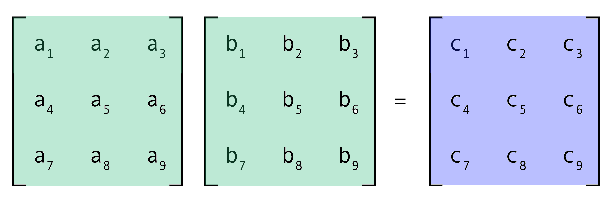

# Matrix Multiplication (Multi-Threading)

## Overview

Multi-threaded Matrix Multiplication program that reads two matrixes from text files, multiplies them, and writes the result to another text file and the corresponding time taken using three different methods.

The input to the program is two matrixes A(x*y) and B(y*z) that are read from corresponding text files. The output is a matrix C(x*z) that is written to an output text file.

The multiplication of two matrices is done using those three methods:

1. A thread computes the output C matrix i.e. without multi-threading. (A thread per matrix).

2. A thread computes each row in the output C matrix. (A thread per row).

3. A thread computes each element in the output C matrix. (A thread per element).

## Usage

* The program is executed as: ./MatrixMul Mat1 Mat2 MatOut, where Mat1 and Mat2 are the names of the text files to read the first and second matrices, respectively, and MatOut is the prefix of the text files names to write the output matrices (each file represents one method). If the user does not enter this information, the default is a.txt and b.txt, for input matrixes A and B, and c for output matrices (of all three methods) C. The following example should clarify inputs/outputs files.

    Arguments

        Example: 
            ./MatrixMul a b c
        Input files: 
            a.txt 
            b.txt
        Output files: 
            c_per_matrix.txt
            c_per_row.txt
            c_per_element.txt

    No Arguments:

        Example: 
            ./MatrixMul
        Input files: 
            a.txt 
            b.txt
        Output files: 
            c_per_matrix.txt
            c_per_row.txt
            c_per_element.txt

    Custom Arguments:

        Example: 
            ./MatrixMul x y z
        Input files: 
            x.txt 
            y.txt
        Output files: 
            z_per_matrix.txt
            z_per_row.txt
            z_per_element.txt

* The input files are on the following format:

        row=3 col=5
        1 2 3 4 5
        6 7 8 9 10
        11 12 13 14 15

* The output files are on the following format:

        

    c_per_matrix.txt

        Time taken by A thread per matrix: 1 microseconds
        Number of threads: 1
        row=2 col=2
        1 2
        3 4

    c_per_row.txt

        Time taken by A thread per row: 0.5 microseconds
        Number of threads: 2
        row=2 col=2
        1 2
        3 4

    c_per_element.txt

        Time taken by A thread per element: 0.25 microseconds
        Number of threads: 4
        row=2 col=2
        1 2
        3 4

## License
This project is licensed under the MIT License - see the [LICENSE](LICENSE) file for details.

